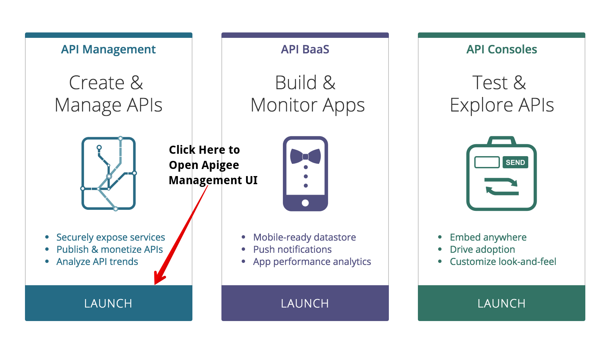
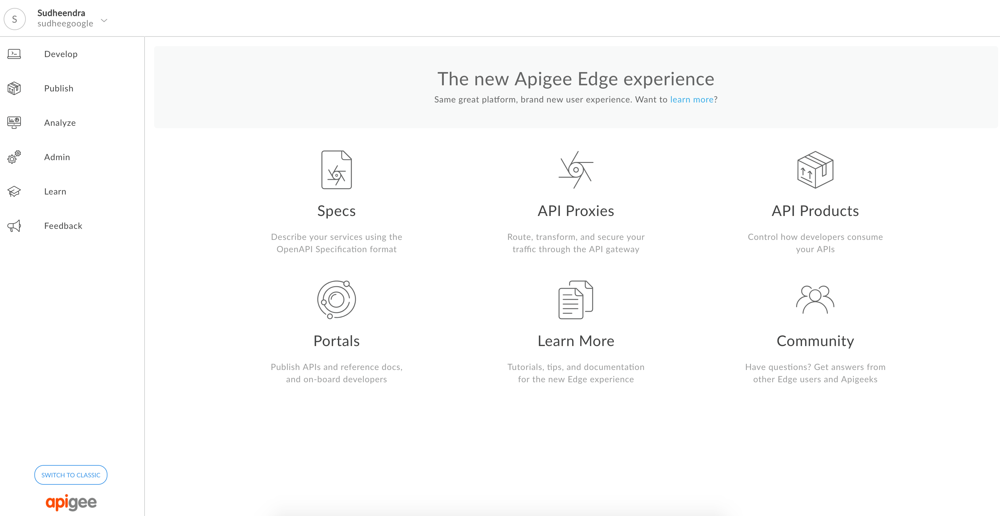

# Getting Started

  In this workshop, you will get first hand exposure to Apigee Edge, the industry's leading API Management platform. To get started with Apigee Edge, you will need to create an account and set up a free trial instance of Apigee Edge that you can use to build our labs today.

   If you're new to Apigee, visit this page to create an account: <a href="https://accounts2.apigee.com/accounts/sign_up" target="_blank">https://accounts2.apigee.com/accounts/sign_up</a>

  If you already have a trial account with Apigee, you can skip this step and use your existing instance. Access your Apigee instance by signing in here: <a href="//https://login.apigee.com/login" target="_blank">https://login.apigee.com/login</a>. 

  After signing into your new account you will see the Apigee launch page:

  

  Select the *Launch* button under the *Create and Manage APIs* to access the Apigee Edge Management UI. This will take you back to the login screen. Enter your credentials and this *SHOULD* take you to the Dashboard of the Apigee Edge Management UI which looks like this:

  

  Once you have successfully created an account and accessed the Apigee Edge Management UI, you are ready to start on the labs. 
 
